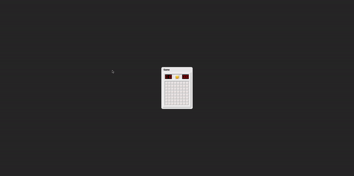
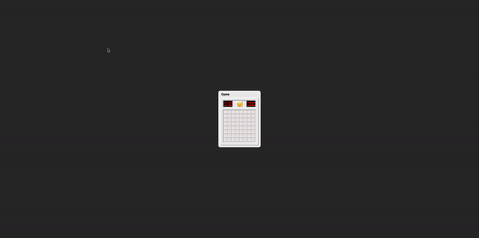
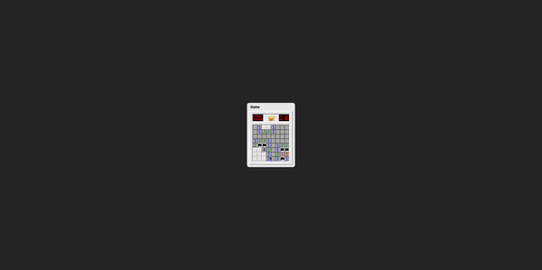

## Google Form Survey

## 구현 사항

모두 구현 완료

- [x] 주어진 링크의 지뢰찾기 게임을 구현 해주세요.
- [x] 첫 번째 빈칸을 열었을 경우에는 지뢰가 터지면 안됩니다.
- [x] 게임 타이머 구현해주세요.
- [x] 오른쪽 클릭 깃발 기능
- [x] 난이도 변경이 가능해야 합니다
  - [x] Beginner (8X8) 지뢰 10개, Intermediate (16X16) 지뢰 40개, Expert (32X16) 지뢰 100개
  - [x] Custom (가로, 세로, 지뢰 수 조정 가능)
    - [x] 설정 가능한 가로, 세로는 최대 100 x 100이며, 지뢰수는 격자칸 수의 1/3 이하로 설정 가능합니다.

<br>

## 추가 구현 사항

- [x] 렌더링 최적화
- [x] 난이도 데이터 저장 (브라우저 새로고침 시 유지)
- [x] 사용자 친화적인 UI/UX

<br>

## 실행 방법

```shell
npm i
npm run dev
```

<br>

## 사용 라이브러리

- redux-toolkit (전역상태 관리)
- react-icons (아이콘 라이브러리)
- styled-components (CSS 라이브러리)

<br>

## 구현 아이디어

### 1. 전역 상태로 레벨 관리

- 레벨 전환 시 현재 선택된 레벨의 타일 X,Y길이와 마인 갯수로 전역 상태로 관리합니다.

```javascript
const initialState: InitialState = {
  value: {
    TITLE: "Beginner",
    X: 8,
    Y: 8,
    MINE: 10,
  },
};
```

### 2. 맵 초기화

- Y좌표, X좌표를 나타내기 위하여 2차원 배열을 전역상태로 관리합니다. 이를 통해 화면에 타일을 map함수로 렌더합니다. `ex: [[...], [...], [...]]`
- 각각의 index에는 타일 정보 객체가 있습니다.

```javascript
export interface TileType {
  // 타일 아이디
  id: string;

  // 왼쪽 클릭으로 편집 가능
  isOpened: boolean; // 열림 여부
  isMined: boolean; // 지뢰 유무 여부

  // 오른쪽 클릭으로 편집 가능
  isStaled: boolean; // 보통 상태인지 아닌지
  isFlagged: boolean; // 깃발이 꽃혀져 있는지 아닌지
  isQuestioned: boolean; // 물음표 상태인지 아닌지

  mineNearby: number; // 근처 지뢰의 갯수
}
```

### 3. 유저의 클릭과 동시에 게임 플레이 초기화(지뢰 심기, 타이머 시작)

- 유저 클릭 좌표와 전후좌우 8방향에는 지뢰가 없도록 구현하였습니다.

```javascript
// useInitializeGame훅
const useIntializeGame = ({ tileMapArr, colIndex, rowIndex, onSetTileMap }: initializeProps) => {
  const { currentLevel } = useLevelSwitch(); // 현재 레벨 저장 훅
  const { MINE, X, Y } = currentLevel; // 마인과 X,Y축 길이 불러옴

  const GenRandomMineHandler = () => {
    const copy = [...tileMapArr];

    let mined = 0; // 마인 갯수
    const maxMineAmount = MINE;
    while (mined < maxMineAmount) {
      // X,Y축 이내로 랜덤 좌표 생성
      const randomY = Math.floor(Math.random() * Y);
      const randomX = Math.floor(Math.random() * X);

      const target = copy[randomY][randomX];
      if (
        // 유저가 클릭한 Index와 겹치거나 인접하면 다시 생성
        randomY >= rowIndex - 1 &&
        randomY <= rowIndex + 1 &&
        randomX >= colIndex - 1 &&
        randomX <= colIndex + 1
      )
        continue;
        // 이미 생성 됐던 좌표면 다시 생성
      if (target?.isMined) continue;

      mined++; // 지뢰 총량 + 1
      target.isMined = true; // 지뢰 심기
      markNearbyAmount(randomX, randomY, copy); // 지뢰 생성 좌표 근처 8방향으로 지뢰 갯수 +1 해주는 함수
      ...
```

### 4. BFS로 근처 지뢰가 없는 열린 타일들만 열고, 숫자가 있는 타일을 만나면 멈추기 구현

<br>
<br>

## 간단 기능 소개

### 1. 지뢰찾기를 플레이할 수 있습니다.

- 첫 번째 빈칸을 클릭 시 지뢰가 터지지 않습니다.



<br>
<br>

### 2. 레벨 전환 및 커스텀 설정을 할 수 있습니다.

- 게임 도중, 게임 오버 시 상관없이 언제나 레벨을 바꾸고 초기화할 수 있습니다.
- 커스텀 설정은 X: 100, Y: 100 이내로 만들 수 있으며 지뢰는 1/3로 설정 가능합니다.



<br>
<br>

### 3. 성공 시 내 스코어가 보입니다.

- 현재 기록과 최고 기록을 볼 수 있습니다.



<br>
<br>

## 추가 구현 사항 설명

### 1. 렌더링 최적화

- 보통 재귀함수로 구현하는 DFS가 더욱 짧은 코드로 구현 가능하지만 BFS보다 성능 효율은 떨어집니다. 맵 설정이 100x100 이상의 사이즈까지 가능하기 때문에 재귀함수로 맵탐색을 구현할 시 콜스택에 재귀함수가 쌓여 메모리가 소진되는 일이 발생할 수 있다는 점을 고려하여 BFS를 선택하였습니다.

### 2. 사용자 친화적인 UI/UX

- 호버 시 내가 클릭 가능한 타일의 색이 바뀝니다.
- 내 최고 기록과 현재 기록을 비교할 수 있습니다.
